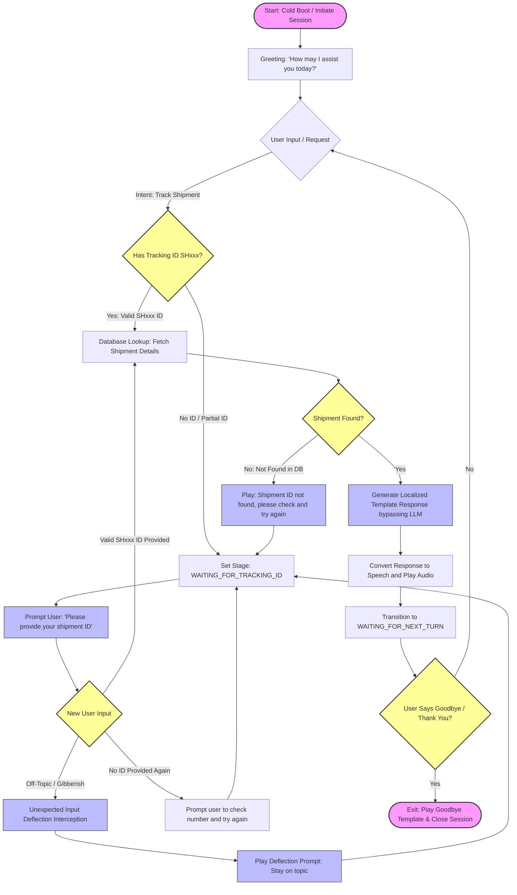
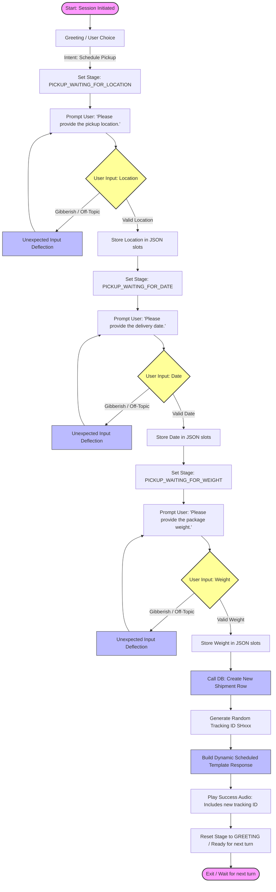
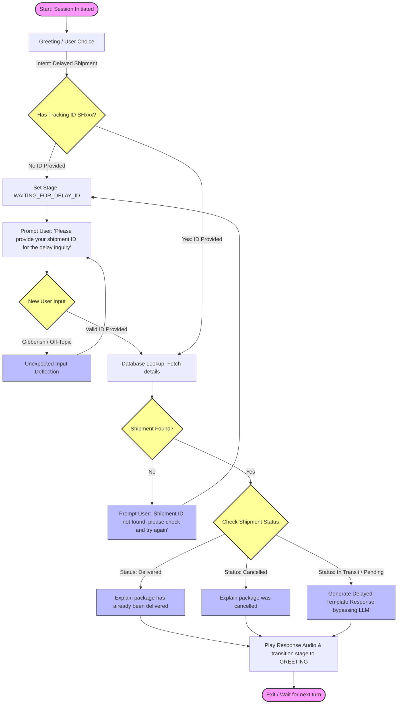
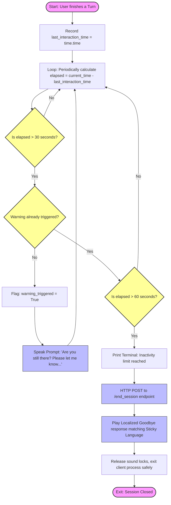

# Conversation Workflow Documentation

This document contains detailed conversation workflow diagrams for the Voice Agent System. It maps the end-to-end paths, user actions, decision points, clarification loops, and exit conditions for the three primary business scenarios: **Shipment Tracking**, **Pickup Scheduling**, and **Delivery Delay Inquiry**.

---

## 1. Shipment Tracking Workflow

This diagram demonstrates the flow when a user requests the status of a package.

---

## 2. Pickup Scheduling Workflow (Slot-Filling)

This diagram documents the multi-turn slot-filling process to schedule a courier collection.

---

## 3. Delivery Delay Inquiry Workflow

This diagram represents the query flow when a user reports or asks about a late package.

---

## 4. Timeout Inactivity Workflow (Two-Stage Idle Rule)

This diagram documents the background automated logic checking inactivity and closing sessions safely.

