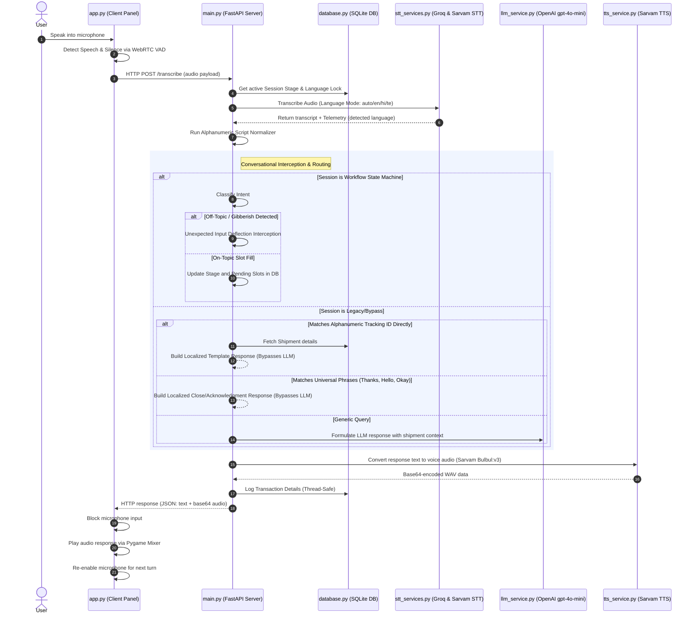

# Voice Agent System: Architecture & Implementation Guide

This document provides a comprehensive, end-to-end technical overview of the Voice Agent Logistics project. It explains the system architecture, internal workflows, dependency catalog, and critical algorithm implementations, so that any engineer can gain a deep, complete understanding of the system's design and operation.

---

## 1. System Overview & Architecture

The Voice Agent is an interactive, multilingual (English, Hindi, Telugu) conversational assistant designed for logistics operations. It allows users to track shipments, schedule pickups, and inquire about shipment delays using real-time voice input.

The project is split into two primary components:
1. **Interactive Client Client-Panel (`app.py`)**: A terminal application that records user audio, detects silence using WebRTC Voice Activity Detection (VAD), calls the backend server via HTTP, and plays back synthesized response audio using Pygame.
2. **FastAPI Web Server Backend (`main.py`)**: A REST API that orchestrates:
   *   **Speech-to-Text (STT)**: Transcribes incoming audio using Groq Whisper API (for English) or Sarvam AI API (for Hindi and Telugu).
   *   **Intent Routing & State Machine**: Implements slot-filling logic, timeouts, and state persistence to handle multi-turn operations.
   *   **Database Management (`database.py`)**: Tracks shipments and persists thread-safe conversation logs in SQLite.
   *   **LLM Orchestrator (`llm_service.py`)**: Uses OpenAI APIs to categorize user requests, query details, or extract parameters when routing is needed.
   *   **Text-to-Speech (TTS)**: Translates response transcripts into synthesized voice audio in the active language using Sarvam AI Bulbul V3.

### Structural Flow Diagram



---

## 2. Structural Dependencies & Code Usage

The project relies on a set of core dependencies to process audio, play sounds, run machine learning pipelines, and serve API requests. Below is a catalog of these libraries, showing where they are imported and why they are critical.

| Dependency | Scope / Primary Use Case | Critical Import Files | Specific Utility in Code |
| :--- | :--- | :--- | :--- |
| **`fastapi`** / **`uvicorn`** | Web serving and endpoint routing. | `main.py` | Hosts `/transcribe`, `/initiate_workflow`, `/end_session`, and startup database initializations. |
| **`pygame`** | Audio playback mixer. | `app.py` | Plays synthesized response audio (`pygame.mixer.music.play()`) and handles audio locks to block microphone recording during agent speech. |
| **`webrtcvad`** | Voice Activity Detection. | `app.py`, `main.py` | Analyzes audio frames (10ms/20ms/30ms) to check if a user is actively speaking (`vad.is_speech()`) to automate speech boundaries. |
| **`sounddevice`** | Audio recording from microphone. | `app.py` | Initiates non-blocking raw audio input streams (`sd.InputStream`) to capture the user's voice into buffers. |
| **`soundfile`** | Reading/writing audio files. | `app.py`, `main.py` | Converts numpy float recording arrays to high-fidelity standard WAV files (`sf.write()`) and extracts PCM formats. |
| **`numpy`** | Array manipulations. | `app.py`, `main.py` | Performs signal analysis on audio streams (e.g. calculates root-mean-square amplitude to calibrate energy thresholds). |
| **`groq`** | Whisper API STT. | `stt_services.py` | Transcribes English spoken speech with low latency targeting `whisper-large-v3`. |
| **`openai`** | LLM completion calls. | `llm_service.py` | Resolves general queries and checks logistics parameters targeting model `gpt-4o-mini`. |
| **`requests`** | REST API client calls. | `stt_services.py`, `tts_service.py` | Directly queries Sarvam AI REST endpoints to execute Indic-language transcriptions or text-to-speech audio conversions. |

---

## 3. Core Workflow Implementation details

### 3.1 VAD Recording Lifecycle
The client panel ([app.py](file:///c:/Users/Lenovo/Desktop/AI_Projects/voice-agent-project/app.py)) maintains an audio loop. 
1. **Calibration**: Upon startup, the client records 1 second of silent ambient noise, calculating the Root-Mean-Square (RMS) amplitude to establish an adaptive noise floor.
2. **Streaming & VAD Analysis**: The client streams raw audio in 30ms frames. A `webrtcvad.Vad` instance analyzes the frames.
3. **Trigger States**:
   *   If speech frames exceed a specific ratio, `recording_state` switches to `Speech Detected`.
   *   Once recording, if silence frames persist for more than 1.5 seconds (the silence window), recording halts.
   *   If zero speech frames are registered during the turn, the client gracefully bypasses backend network calls to conserve tokens.

### 3.2 State Machine workflows
Sessions initiated via `/initiate_workflow` transition through a strict multi-turn state machine:

```
[GREETING]
    │
    ├─► User Intent: Schedule Pickup ──► [PICKUP_WAITING_FOR_LOCATION]
    │                                                 │  (User supplies Location)
    │                                                 ▼
    │                                    [PICKUP_WAITING_FOR_DATE]
    │                                                 │  (User supplies Date)
    │                                                 ▼
    │                                    [PICKUP_WAITING_FOR_WEIGHT]
    │                                                 │  (User supplies Weight)
    │                                                 ▼
    │                                    [SCHEDULED_SUCCESS] ──► (Create Shipment & End)
    │
    ├─► User Intent: Track Shipment ───► [WAITING_FOR_TRACKING_ID]
    │                                                 │  (User supplies valid SHxxx ID)
    │                                                 ▼
    │                                    [TRACKING_SUCCESS] (Bypasses LLM via Direct Template)
    │
    └─► User Intent: Delay Inquiry ────► [WAITING_FOR_DELAY_ID]
                                                      │  (User supplies valid SHxxx ID)
                                                      ▼
                                         [DELAY_SUCCESS] (Direct Template Response)
```

---

## 4. Key Logic & Code Snippets

Here are the most critical implementations that govern the behavior of the voice agent.

### 4.1 Thread-Safe State Storage ([database.py](file:///c:/Users/Lenovo/Desktop/AI_Projects/voice-agent-project/database.py))
To prevent race conditions during concurrent requests on the same session, state storage operations are protected by a global thread lock.

```python
import sqlite3
import json
import threading

db_lock = threading.Lock()
DB_FILE = "voice_agent.db"

def update_session_state(session_id: str, stage: str, pending_slots: dict, lang: str):
    """
    Serializes slots and updates the conversation state under a thread-safe lock.
    """
    with db_lock:
        conn = sqlite3.connect(DB_FILE)
        cursor = conn.cursor()
        try:
            # Serialize the pending slot variables
            slots_str = json.dumps(pending_slots)
            cursor.execute(
                """
                INSERT INTO conversation_logs (session_id, current_stage, pending_slots, detected_language)
                VALUES (?, ?, ?, ?)
                ON CONFLICT(session_id) DO UPDATE SET
                    current_stage = excluded.current_stage,
                    pending_slots = excluded.pending_slots,
                    detected_language = excluded.detected_language
                """,
                (session_id, stage, slots_str, lang)
            )
            conn.commit()
        finally:
            conn.close()
```

### 4.2 Legacy vs. Workflow Session Language Routing ([main.py](file:///c:/Users/Lenovo/Desktop/AI_Projects/voice-agent-project/main.py))
To avoid database pollution and test suite failures, the server maintains an in-memory registry of active workflow sessions. It routes language locks dynamically based on the session type:

```python
active_workflow_sessions = set()

# Inside /transcribe route:
is_workflow_session = session_id in active_workflow_sessions

if is_workflow_session:
    # State Machine Language Resolution
    current_stage, pending_slots, cached_lang = database.get_session_state(session_id)
    override_lang = detect_language_override(transcript)
    if override_lang:
        logged_lang = map_override_lang_to_code(override_lang)
    else:
        logged_lang = cached_lang if cached_lang else active_lang
else:
    # Legacy Direct STT Language Resolution
    current_stage = "GREETING"
    pending_slots = {}
    cached_lang = database.get_session_language(session_id)
    
    override_lang = detect_language_override(transcript)
    if override_lang:
        logged_lang = override_lang
    else:
        if cached_lang:
            logged_lang = map_override_lang_to_code(cached_lang)
        else:
            # Extract language code from result telemetry if "auto" was selected
            if language_code == "auto":
                logged_lang = result["telemetry"].get("detected_language", "English")
            else:
                logged_lang = language_code
```

### 4.3 Alphanumeric Normalizer & Whitespace Collapse ([main.py](file:///c:/Users/Lenovo/Desktop/AI_Projects/voice-agent-project/main.py))
Whisper transcribes spoken Indic tracking characters and numbers phonetically (e.g. "ఎస్ హెచ్" or "एस एच" for "SH", "టూ" for "2"). The alphanumeric normalizer converts these phonetics and joins trailing whitespaces:

```python
import re

def normalize_indic_alphanumerics(text: str) -> str:
    if not text:
        return text

    mapping = {
        # Phonetic letters
        "ఎస్ హెచ్": "SH", "एस एच": "SH", "एसएच": "SH",
        # Telugu digits
        "వన్": "1", "టూ": "2", "త్రీ": "3", "ఫోర్": "4", "ఫైవ్": "5",
        # Hindi digits
        "वन": "1", "टू": "2", "थ्री": "3", "फोर": "4", "फाइव": "5"
    }

    normalized = text
    # Apply mapping sorted by pattern length (longest first) to prevent partial matching
    for pattern in sorted(mapping.keys(), key=len, reverse=True):
        normalized = normalized.replace(pattern, mapping[pattern])

    # Collapse space separating SH prefix and digits (e.g., "SH 1 2 3" -> "SH123")
    normalized = re.sub(r'\bSH\s+(\d+)\b', r'SH\1', normalized, flags=re.IGNORECASE)
    normalized = re.sub(r'\bSH\s+([a-zA-Z0-9]+)\b', r'SH\1', normalized, flags=re.IGNORECASE)
    
    return normalized
```

### 4.4 Unexpected Input Deflection ([main.py](file:///c:/Users/Lenovo/Desktop/AI_Projects/voice-agent-project/main.py))
If the agent is gathering slots (e.g., waiting for package weight), and the user inputs off-topic speech (e.g., "tell me a joke") or gibberish (unvowelled inputs), the system deflects the input, bypasses the LLM, and reminds the user of the pending slot in their active language:

```python
def is_off_topic_query(text: str) -> bool:
    """
    Detects if the user text asks for unrelated topics or contains gibberish.
    """
    if not text:
        return False
    t = text.lower().strip()
    
    # Common off-topic keywords
    off_topic_keywords = {
        "joke", "weather", "song", "story", "meaning of life", "who are you", "what is your name"
    }
    if any(k in t for k in off_topic_keywords):
        return True
        
    # Gibberish check: search for words >= 4 letters that contain no vowels
    words = t.split()
    for w in words:
        # Check standard and Indic vowel glyphs
        if len(w) >= 4 and not any(v in w for v in "aeiouy\u0c05\u0c06\u0c07..."):
            return True
            
    return False

# Route handler checking deflection:
if is_off_topic:
    # Direct deflect bypasses LLM
    if logged_lang.startswith("te"):
        ai_response = "నేను అర్థం చేసుకున్నాను, కానీ మీ అభ్యర్థనకు సహాయం చేయడానికి అవసరమైన వివరాలు అందించండి."
    elif logged_lang.startswith("hi"):
        ai_response = "मैं समझता हूँ, लेकिन आपकी सहायता करने के लिए कृपया आवश्यक जानकारी प्रदान करें।"
    else:
        ai_response = "I understand, but to help you with your request, I need you to provide the requested logistics information."
```

### 4.5 Resilient API Retry Loop with Exponential Backoff ([tts_service.py](file:///c:/Users/Lenovo/Desktop/AI_Projects/voice-agent-project/tts_service.py))
To prevent failure from transient network dropouts or API rate-limiting, external calls are wrapped in a retry loop:

```python
import time

def generate_speech_b64(text: str, target_language_code: str = "en-IN") -> str | None:
    max_retries = 3
    delay = 1.0  # initial sleep duration in seconds
    
    for attempt in range(max_retries):
        try:
            # Execute SDK conversion call
            audio_data = convert_text_to_speech_via_sdk(text, target_language_code)
            return audio_data
        except Exception as e:
            if attempt == max_retries - 1:
                # Log final error
                print(f"[TTS Error] Final attempt failed: {e}")
                return None
            print(f"[TTS Error] Attempt {attempt + 1} failed. Retrying in {delay}s...")
            time.sleep(delay)
            delay *= 2  # Exponential backoff
```

---

## 5. Summary of System Workflow Details

1. **Client Initiation**: The user runs `app.py`. A session is started.
2. **Audio Streaming**: User speaks. Voice activation triggers recording, and silence triggers recording close.
3. **FastAPI Route `/transcribe`**:
   *   Decodes WAV structure.
   *   Detects Language Lock.
   *   Performs STT.
   *   Applies Script Normalizer.
   *   Processes state machine or legacy path templates.
   *   Persists interaction history and variables to SQLite.
   *   Synthesizes TTS audio using Bulbul v3.
4. **Playback**: The client panel plays the returned audio payload and opens the microphone for the next turn, maintaining session variables.
